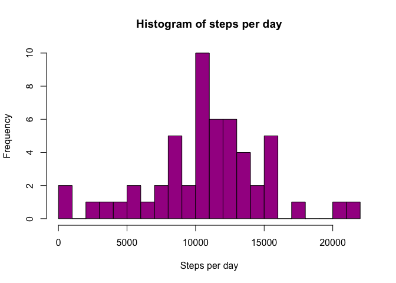
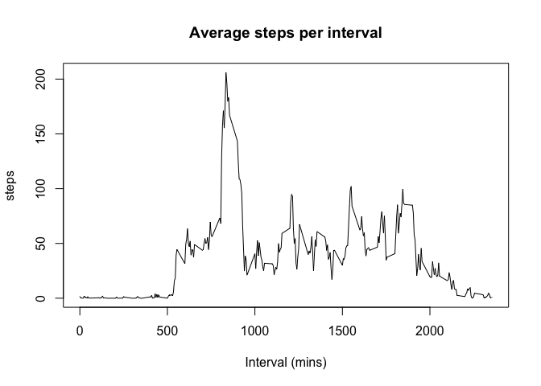
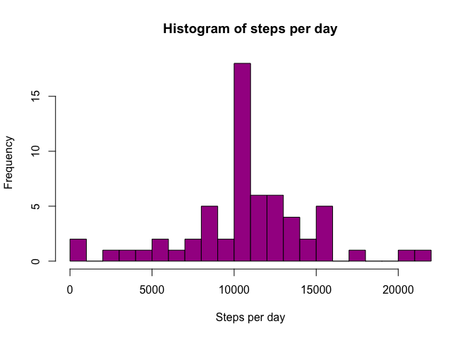

## Loading and preprocessing the data

I'm going to use unzip function then read.csv function. 


```r
unzip("activity.zip")
activity <- read.csv("activity.csv", stringsAsFactors = F)

activity$date <- as.Date(activity$date)
```

## What is mean total number of steps taken per day?


```r
Daily_steps <- aggregate(steps ~ date, data = activity, sum)

# histogram of the daily steps 
hist(Daily_steps$steps, xlab = "Steps per day", main = "Histogram of steps per day", breaks = 20, col = "#A40B92")
```

<!-- -->

```r
# mean steps per day 
mean(Daily_steps$steps)
```

```
## [1] 10766.19
```

```r
# median steps per day 
median(Daily_steps$steps)
```

```
## [1] 10765
```

## What is the average daily activity pattern?


```r
interval_average <- aggregate(steps ~ interval, data = activity, mean)

plot(interval_average, type = "l", main = "Average steps per interval", xlab = "Interval (mins)")
```

<!-- -->

```r
max(interval_average$steps)
```

```
## [1] 206.1698
```

```r
row_index <- which(interval_average$steps == max(interval_average$steps))

# interval that has the maximum number of steps 
interval_average$interval[row_index]
```

```
## [1] 835
```


## Imputing missing values


```r
## how many NAs 
sum(is.na(activity$steps))
```

```
## [1] 2304
```

```r
## imputing steps using mean 
steps_imputed <- activity
steps_imputed$steps[is.na(steps_imputed$steps)] <- mean(activity$steps,na.rm =T)

sum(is.na(steps_imputed$steps))
```

```
## [1] 0
```

```r
Daily_steps2 <- aggregate(steps ~ date, data = steps_imputed, sum)

# histogram of the daily steps 
hist(Daily_steps2$steps, xlab = "Steps per day", main = "Histogram of steps per day", breaks = 20, col = "#A40B92")
```

<!-- -->

```r
# mean steps per day 
mean(Daily_steps2$steps)
```

```
## [1] 10766.19
```

```r
# median steps per day 
median(Daily_steps2$steps)
```

```
## [1] 10766.19
```

After imputation, mean steps per day stays the same, but median increases slightly 10766.19

## Are there differences in activity patterns between weekdays and weekends?
